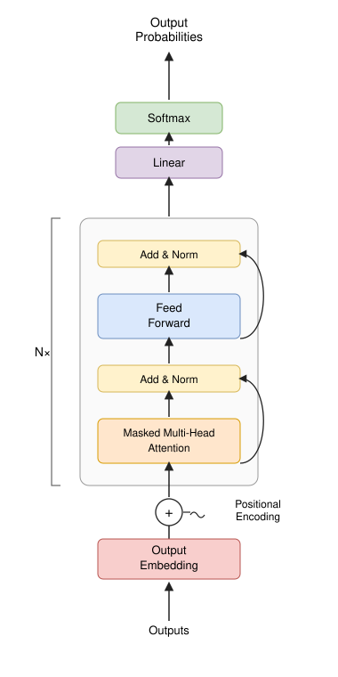

# AI Investigation

A GPT-style decoder-only transformer built from scratch in PyTorch, trained on
character-level Shakespeare, with custom tooling to visualize what's happening
inside it during both training and inference.

<p align="center">
  
</p>

This is the shape [`transformer/model.py`](transformer/model.py) implements: no
encoder, no cross-attention. Just token + positional embeddings, a stack of
decoder blocks (masked self-attention, then a feed-forward layer, each wrapped
in a pre-norm residual connection), a final norm, and a linear projection back
to vocabulary logits.

## Layout

```
transformer/     the model itself: build it, train it, watch it learn
  model.py               the architecture - embeddings, attention, decoder blocks
  train.py                the training loop (char-level Shakespeare, ~5M params)
  visualization.py         records training snapshots into a playable HTML viewer
  viewer_template.html      the viewer page visualization.py fills in
  architecture.svg           the diagram above
  input.txt                   tiny-shakespeare, the training data
  results/                     a saved checkpoint + two example training viewers

inference/       running a pretrained model (GPT-2) and seeing inside it
  infer_vllm.py               generation through vLLM - the actual serving skill
  infer_naive_compare.py       the same generation without batching, for comparison
  infer_visualize.py            re-runs generation with plain transformers + hooks
  inference_viewer_template.html the viewer infer_visualize.py fills in
```

## Training the transformer

```bash
pip install torch
python transformer/train.py
```
Trains for 5000 steps on a GPU (falls back to CPU, just slower), downloading
tiny-shakespeare on first run. Writes `training_viewer.html` and
`checkpoint.pt` as it goes - open the html file in a browser to scrub through
training step by step: the embedding table, every layer's activations, every
attention head, and the model's live predictions on a fixed probe sentence.

Two example runs are already saved in
[`transformer/results/`](transformer/results/) if you just want to look
without training anything yourself.

## Running inference with vLLM

```bash
pip install vllm transformers
python inference/infer_vllm.py       # generation through vLLM, single prompt + a 64-prompt batch
python inference/infer_naive_compare.py  # the same 64 prompts, one at a time, no batching
python inference/infer_visualize.py  # re-runs generation with hooks, writes inference_viewer.html
```
`infer_vllm.py`'s batch step and `infer_naive_compare.py`'s loop are meant to
be compared directly - the gap between their tok/s numbers is what vLLM's
continuous batching and PagedAttention KV cache are actually buying you, which
a single-prompt call never shows.

## Next: CUDA

The natural follow-up here is writing a custom CUDA kernel for the attention
block (`MultiHeadAttentionBlock.attention` in `transformer/model.py`) and
benchmarking it against PyTorch's built-in implementation.
